### WebArAr Tutorial

*This documentation provides guidance on how to use WebArAr.*

*Last updated: **Feb 25, 2024***

[简体中文](Tutorial_zh_CN.md)

### Content

1. [General procedure](#general-procedure)
2. [Import raw data](#import-raw-data)
3. [Arr files](#arr-files)
4. [Create new sample](#create-new-sample)
5. [Set raw-file filter](#set-raw-file-filter)
6. [Calculate blank](#calculate-blank)
7. [Tables and figures](#tables-and-figures)
8. [Set parameters](#set-parameters)
9. [Recalculation](#recalculation)
10. [Isochron scatter points selection](#isochron-scatter-points-selection)
11. [Change figures styles](#change-figure-styles)
12. [Air-corrected plateaus](#air-corrected-plateaus)
13. [Age distribution figure](#age-distribution-figure)
14. [Save and export](#save-and-export)

### General procedure

1. **Input data**

    * Support to read the original mass spectrometer output file: See [Import raw data](#import-raw-data).
    
    * Open arr files: arr is the format with which WebArAr saves Sample objects. See [Arr files](#arr-files).
    
    * Open files of ArArCALC software, including age and xls files.
    
    * Create a new object: See [Create new sample](#create-new-sample). 

2. **View, modify, and calculate for a open sample object**

    After the Sample object is successfully created and opened, the object page will display some tables and figures. 

    

    Any files that have been opened will no longer be associated with the user's local file, the Sample object is passed between the server and the client in the form of data streams, and will be not automatically saved, so unless the user downloads the arr file, all operations will be lost when the page is closed.

    The actions that can be performed on the object page include:

    * Edit tables: 

        All tables are editable. After editing, click Save changes below the table to save your changes. See [Tables and figures](#tables-and-figures) for content in each table or figure.

    * Edit parameters: 

        *Note: The calculation will not be automatically called after the parameter is modified. See [Recalculation](#recalculation).*

        - **Total Param** include all parameters, editing this table and saving to set new parameters for the Sample.

        - Set parameters by three parameter sets, namely Irra Params, Calc Params, and Smp Params. This will change parameters of all **sequences**. See [Setting parameters](#set-parameters)

    * Interaction with figures:

        All figures are rendered by Echarts and therefore have Echarts features and attributes. Some commonly used properties are editable. See [Change figure styles](#change-figure-styles).

    * Select points used for regression in isochron plots

        See [Isochron scatter points selection](#isochron-scatter-points-selection).

        WebArAr provides five isochrons, including normal and inverse isochrons and three chlorine related isochrons. All isochrons and age spectra will use the same **sequence** selection combination, supporting two combinations, namely Set1 and Set2.


### Import raw data

* The raw files usually include at least the following information: the zero-time, analysis time, and intensities of five isotopes of each **cycle**.

* The raw files will be read based on given filters. [Set raw-file filter](#set-raw-file-filter) provides instructions and examples for creating filters.

    1. Mass Spec Raw Files 
    
        

    2. Multiple raw files can be opened together and filters need to be selected for each file
    
        

* Extrapolating the intercepts at zero-time.

    You can click to deselect some outliers, decide whether to cancel this scatter point for all isotopes of the current **sequence**, select the fitting method to be adopted, check whether to apply this fitting method to all isotopes, and set the current **sequence** as the background. It is possible to export the sequence for later use.

    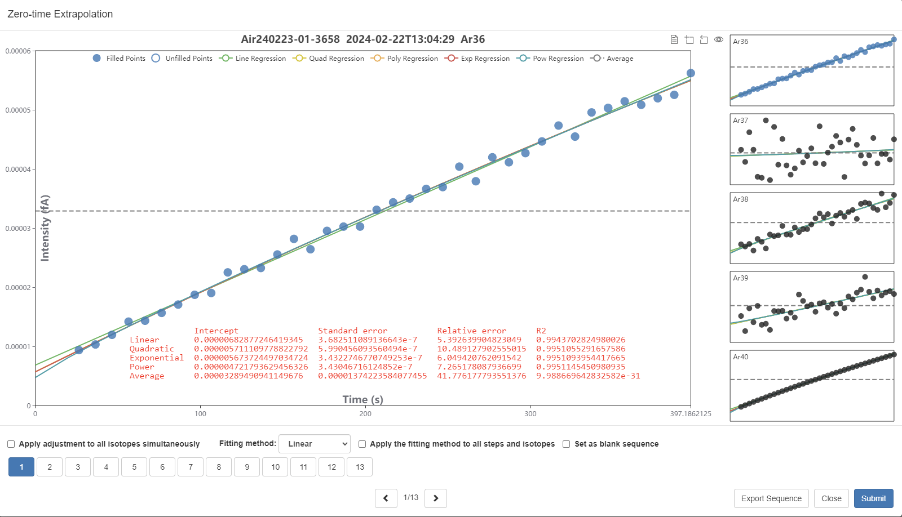

* Assign blanks for each sample sequence.

    In the case of example below, three sequences of 1-7-13 are defined as blank sequences. There are four strategies to couple sample and blank sequences. It is also possible to select blanks for each sample sequence in drop-down boxes. The blank sequences can be calculated in the right interface. See [Calculate blank](#calculate-blank).

    

    Four strategies:
    1. **Pre-run**: Each blank is used to correct the sample sequence performed after it until the next blank conducted, and if the first sequence is not blank, the first blank will also be used to deduct several sample sequence before it;
    2. **Post-run**: Each blank will be used to correct the sample stage performed before it, and if the last sequence is not the blank, the last blank will also be used to deduct the last several sample sequences;
    3. **Adjacent**: Each blank sequence will be used to correct the nearest several sample sequences.
    4. **Interpolation**: The fitting line between the time and blank intensities can be defined from the given several blank sequences, and blanks of sample sequences can be obtained by interpolation.

 

### arr files

* The arr files are saved in binary format and in principle are JSON-serialized Sample object.


### Create new sample

* Creating an empty object supports manually entering data by users.

* It is often convenient when only some parts of WebArAr's functionality is required, such as plotting age spectra.


### Set raw-file filter

1. The entry of editing raw-file filters on the *Run* page.

    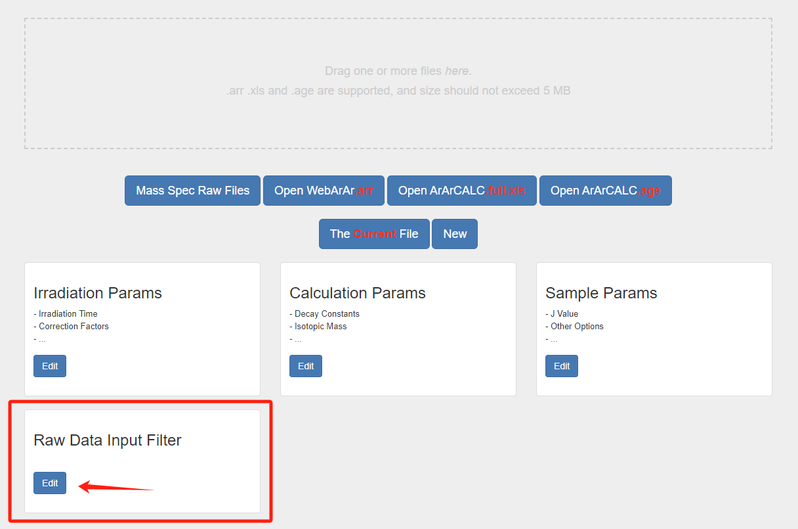

2. Edit an existing filter (requires Pin-verification), or create a new one.

    

3. The filter is used to read isotope intensities and information correctly from the files. Text format files and Excel Multitable files (xls) are supported. For xls files, table, row, and column indexes are three-digit integers used to locate data. For text files, rows and columns are needed. 

    *Note: all indexes are 1 based*

4. Example 1: AHD files.
    
    AHD files might have following contents. Download the [AHD file](AHD.ahd).

    ```
    Sample	sample_name							
    Experiment	experiment_name							
    Project								
    Irradiation								
    Standard								
    Instrument	Argus	1E-13						
    Time Stamp	21/06/2023	0:08:53						
    Analyst								
    Temperature	0	Laser						
    J-Value								
    Fractionation								
    Volume Correction	1							
    Counters	1	15	1	0				
                                    
    Time	Intensity	37	38	39	40		Cycle #	Peakreading #
    96.124784	0.039713085					
    139.839784	0.017819889							
    96.124784	0.095037932							
    96.124784	8.217368387							
    96.124784	52.50271246							
    183.630784	0.039292885							
    227.343784	0.01599587							
    183.630784	0.088180873							
    183.630784	7.980598974							
    183.630784	53.55335785	
    ```

    According to the contents above, we can find: head information count for 15 rows, sample name (0, 1, 2), experiment name (0, 2, 2), date of zero-time (0, 7, 2), time of zero-time (0, 7, 3), isotopic values are presented vertically in groups of five, so 36Ar is located at (1, 2), 37Ar (2, 2), 38Ar (3, 2), 39Ar (4, 2), 40Ar (5, 2), analysis time is 36Ar (1, 1), 37Ar (2, 1), 38Ar (3, 1), 39Ar (4, 1), 40Ar (5, 1). And note that date and time are in one string respectively.

    

5. Example 2: xls files exported from NGX software. 

    Contents of the file are partly shown as the following figure. Download [NGX_Exported_XLS](NGX_Exported_XLS.xls) for reference.

    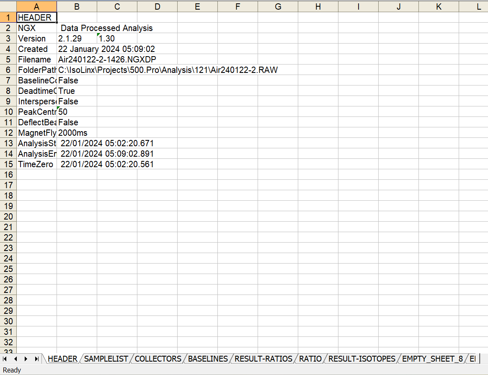

    

    For this file, the filter Settings are as follows:

    
	

### Calculate blank

1. Click the blank name to add the blank into Input input-box. Click again to delete the blank.

    

2. Choose to calculating average or fitting the interpolation.

    As shown in the figure below, three blank sequences give a regression constraining blanks of ten sample sequences.

    

    After calculating the average or interpolation, a new blank name will appear in the Output text-box, click the *Add* button to add it as a blank, after which you can select it in the drop-down boxes on the left.

    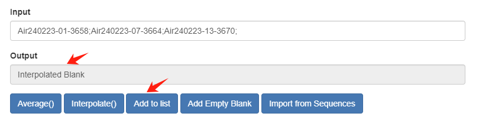


### Tables and figures

**Tables**

1. Information: Sample information, such as number, mineral material, laboratory, etc
2. Unknown: Isotopic values for each sample sequence. Errors are in 1σ.
3. Blank: Used blank values of each sample sequence.
4. Corrected: The isotopic values of each sample sequence after necessary corrections, including blank correction, mass discrimination correction, and decay correction.
5. Degas Pattern: The value of each isotope after distinguishing their sources.
6. Publish: In most cases, it is used to publish Ar-Ar data in a paper, including stage name, stage conditions, 36Ara, 37ArCa, 38ArCl, 39ArK, 40Arr, apparent age, age error, proportion of 40Arr in each sequence, ratio of 39ArK released in each sequence to the total amount, and Ca/K value.
7. Age Spectra: 40Arr/39ArK and apparent ages.
8. Isochrons: Data of normal, inverse, and Cl-related isochrons and the 3D plot.
9. Total Params: All parameters involved in calculation.

**Figures**
1. Age Spectra: Age spectra.
2. Nor. Isochron: Normal isochron plot. 
3. Inv. Isochron: Inverse isochron plot.
4. K-Cl-Ar 1: Cl correlation plot 1 in two dimensions. Note the difference in axes between three Cl plots.
5. K-Cl-Ar 2: Cl correlation plot 2 in two dimensions.
6. K-Cl-Ar 3: Cl correlation plot 3 in two dimensions.
7. 3D Correlation: Correction plot in three dimensions. 
8. Degas Pattern: Shows the proportion of different isotope contributions released at each sequence. 
9. Ages Distribution: Shows the distribution of apparent ages, including bar charts and KDE curves.

### Set parameters

* The parameter setting is divided into three categories: Irradiation Params, Calculation Params (calculation constants), and Sample Params.

* Add or edit parameter sets in *Run* page for later use.

    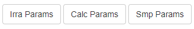

* It is also possible to modify parameters arbitrarily in the Total Params table, which allows you to set different parameters for each sequence.

* Irradiation Params

    

* Calculation Params

    

* Sample Params

    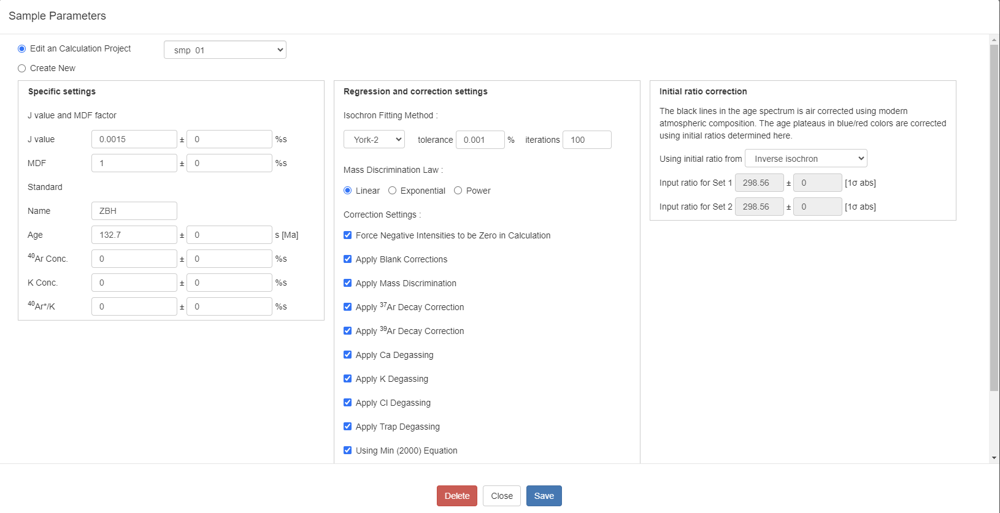

### Recalculation 

* Recalculation will be not called after setting new parameters.

* The options that can be used: 

    - Reset Arr Attributes: Check the structure of Arr files, which can be used to fix old files that are missing some attributes due to program updates.
    - Recalculate Correction and Degas:
        
        For correct recalculation, specific procedures and subsequent calculations need to be selected. For example, if you modify some blank values, you need to select all the options from blank correction to age calculation, otherwise the new parameters will not really affect the final result; If you just modify the J-value, you only need to select recalculation of apparent age, the previous stage is not affected by the J-value, and you should also Reset Plot Data to recalculate plateau and isochron ages wiht the new J value

    - Reset Plot Style: reset styles of figures

    

### Isochron scatter points selection

* The isochron supports two sets of point selection (Set1 and Set2), and the corresponding age plateau will be drawn in the age spectrum (the age plateau will be deducted for the air argon by the specified initial value according to the setting). The normal and inverse isochrons and plateau ages of the two point groups are displayed on the right.

    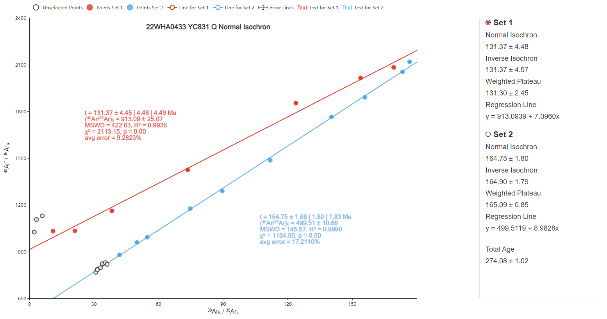

* Clicking a scatter allows you to select or deselect a point for regression. Regression and age are automatically recalculated with each click, and response speed is related to network speed and number of stages.

* In order to improve the operation, you can hold down the Ctrl and then click on multiple data points. It will not automatically recalculate, and then need to trigger recalculation, or release the Ctrl and click a scatter point. In this case only one recalcualtion is conducted.

### Change figure styles

* Click the Style button at the bottom to set styles of the currently displayed figure, such as axes range, line width, color, size, etc.

* When the Style dialog is open, click on elements, such as lines, points, or texts, to set styles of the corresponding elements.
    
    For example, after opening Style, click a Scatter to open scatter style Settings, as shown in the following figure.

    

    Set the point size to 20:

    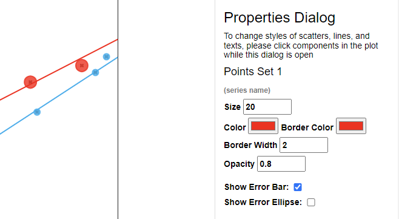

### Air-corrected plateaus

* Set initial values for Set1 and Set2 in the Sample Parameter.

* Air-corrected using the initial value of inverse isochron lines: 

    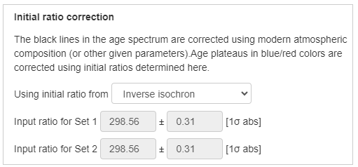

    

* Air-corrected using the specific initial values. In the following case a value same to the blank age spectra was used, so the red/blue lines and black lines overlap: 

    
    
    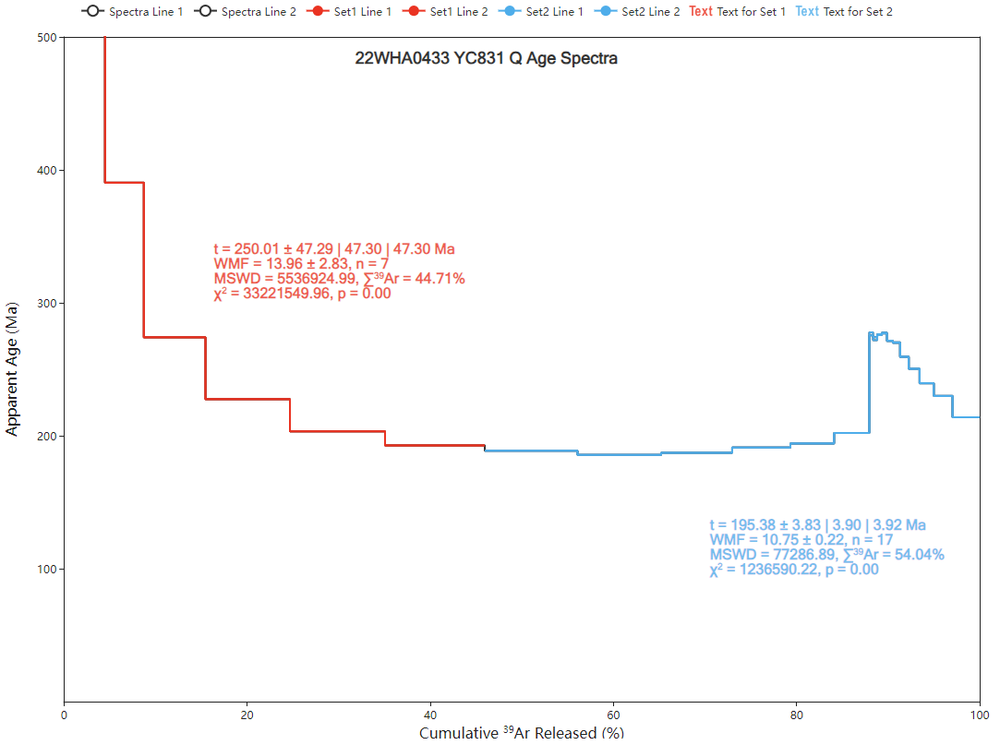

### Age distribution figure

* Age profiles are often used for single-grain Ar-Ar age analysis. Data are derived from apparent ages in the Age Spectra table. The figure includes KDE curves, bar charts, and age boxes.

    

* After opening Style, click on the red KDE curve to set the properties and KDE parameters:
    Normal probability density function is often used. Scott and Silverman are two methods to calculate bandwidth automatically. Or setting Auto Width to *none* and entering bandwidth. 

    

### Save and export

* Click Export to open the Export dialog. 

    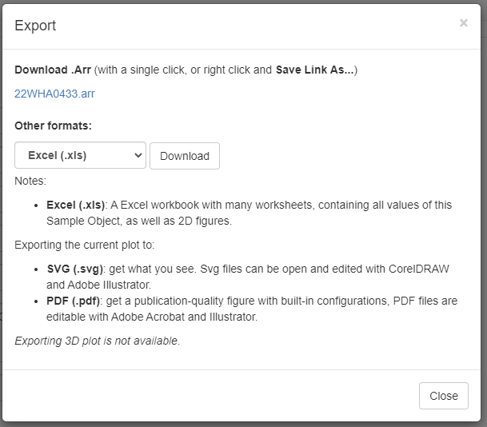

* To download the arr file, click *sample_name.arr* or right-click to save it.

* Choose another format to export::

    1. Excel: Contains all data and charts (except 3D plot)；
    2. PDF: Export 2D figures to PDF, which can be opened and edited with Illustrator and CorelDRAW.
    3. SVG: Export 2D figures to SVG.
