### WebArAr 使用教程
*本文档更新于 **2024年2月25日***

[English](Tutorial.md)

### 目录

1. [基本流程](#基本流程)
2. [导入原始文件](#导入原始文件)
3. [arr文件](#arr文件)
4. [创建空白对象](#创建空白对象)
5. [设置原始文件过滤器](#设置原始文件过滤器)
6. [计算本底](#计算本底)
7. [图表内容](#图表内容)
8. [参数设置](#参数设置)
9. [重新计算](#重新计算)
10. [等时线选点](#等时线选点)
11. [修改图件样式](#修改图件样式)
12. [用等时线初始值扣空气氩](#用等时线初始值扣空气氩)
13. [年龄分布图](#年龄分布图)
14. [保存及导出](#保存及导出)
15. [示例1：打开文件](#示例-1打开文件)
    
    [示例1-1：打开arr、age、xls文件](#示例-1-1打开-arragexls-文件)
    
    [示例1-2：打开原始文件](#示例-1-2打开原始文件)

15. [示例2：手动输入数据计算或绘图](#示例-2手动输入数据计算或绘图)
    
    [示例2-1：绘制年龄谱](#示例-2-1绘制年龄谱)
    
    [示例2-2：绘制等时线](#示例-2-2绘制等时线)

15. [示例3：等时线选点](#示例-3等时线选点)
15. [示例4：修改图谱样式](#示例-4修改图谱样式)
    
    [示例4-1：修改等时线样式](#示例-4-1修改等时线样式)
    
    [示例4-2：修改图中文字](#示例-4-2修改图中文字)
    
    [示例4-3：修改坐标范围](#示例-4-3修改坐标范围)

15. [示例5：导出和保存](#示例-5导出和保存)
    
    [示例5-1：保存arr](#示例-5-1保存-arr)
    
    [示例5-2：导出到dpf](#示例-5-2导出到dpf)
    
    [示例5-3：导出到excel](#示例-5-3导出到excel)

15. [示例6：修改参数集](#示例-6修改参数集)
    
    [示例6-1：创建新的参数集](#示例-6-1创建新的参数集)
    
    [示例6-2：修改参数集](#示例-6-2修改参数集)
    
    [示例6-3：删除参数集](#示例-6-3删除参数集)


### 基本流程

1. **导入数据**

    * 支持读取质谱仪输出的**原始文件**：参阅[导入原始文件](#导入原始文件)。
    
    * 打开 **arr** 文件：arr 文件是WebArAr保存文件时的格式。参见[arr文件](#arr文件)。
    
    * 打开 ArArCALC 软件相关的 **age** 文件或其导出的 **xls** 文件。其他形式的 xls 文件不被支持。
    
    * 创建**空白**对象：参阅[创建空白对象](#创建空白对象)。

2. **查看、修改、计算**

    成功创建并打开样本对象后，将进入对象显示页面。左侧导航栏列出该对象拥有的表格和图形。

    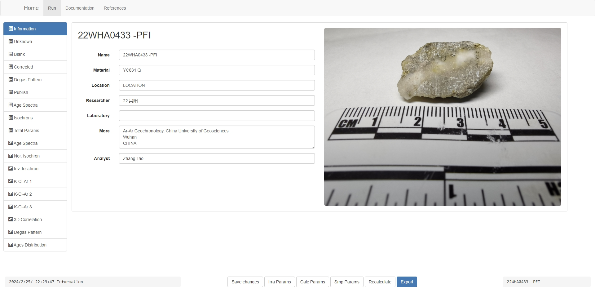

    已打开的任何文件都将不再与用户的本地文件有关联，Sample 对象以数据流的形式在服务器端和用户端之间传递，不会自动形成文件，因此，除非用户下载 arr 文件，否则关闭窗口时将丢失所有操作。

    在对象显示页面可以进行的操作包括：

    * **修改样品信息**：
            
        采样地点、实验室、研究人员等信息可在 Information 修改，这些与计算无关。
    
    * **修改表格内容**：
    
        所有的表格都是可编辑的，编辑后需要点击下方 Save changes 以保存修改。[图表内容](#图表内容) 介绍了各个图表中的详细内容。
    
    * **修改参数集**：
    
        *注意：修改参数后不会自动调用计算，需要用户根据需要触发重新计算。参见 [重新计算](#重新计算)。*
    
        - Total Param 包括了所有参数，编辑该表格并保存可以设置新的参数。
    
        - 通过下方的 Irra Params、Calc Params 和 Smp Params 为所有阶段选择预先设定好的参数集，或手动输入参数。参见 [参数设置](#参数设置)
    
    * **修改图谱样式**
    
        所有的图形都由Echarts渲染，因此具备Echarts的特征和属性。为一些常用的属性添加了设置选项，参见[修改图件样式](#修改图件样式)。
    
    * **等时线中选点拟合**
    
        参见 [等时线选点](#等时线选点)。
    
        WebArAr提供了五个等时线，包括正反等时线和三个与氯相关的等时线。所有等时线和年龄谱图将使用相同的阶段选择组合，支持两种选择组合，即 Set1 和 Set2。

### 导入原始文件

* 原始文件通常需要至少包括以下信息：每个 **cycle** 的**零时刻时间**，**测量时间**，**信号量**。

* 根据特定的**过滤器**读取文件内容，[设置原始文件过滤器](#设置原始文件过滤器) 提供了设置过滤器的说明和示例。

    1. Mass Spec Raw Files 
    
        

    2. 可以一起打开多个原始文件作为一个样品文件，为每个文件选择过滤器 
    
        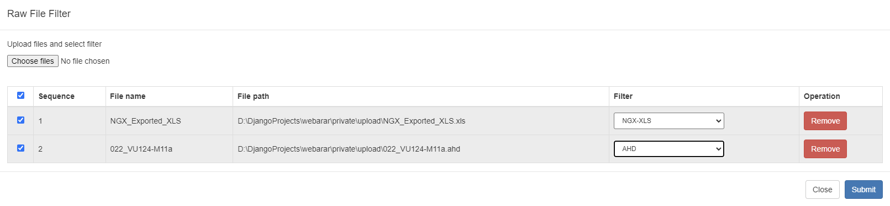

* **外推零时刻值**。

    可单击取消选择某些离群点，可勾选是否对这当前 **阶段** 的所有同位素都取消这一散点，可选择要采纳的拟合方式，可勾选是否将这个拟合方式对所有同位素应用，可将当前 **阶段** 设置为 本底，可导出指定阶段。

    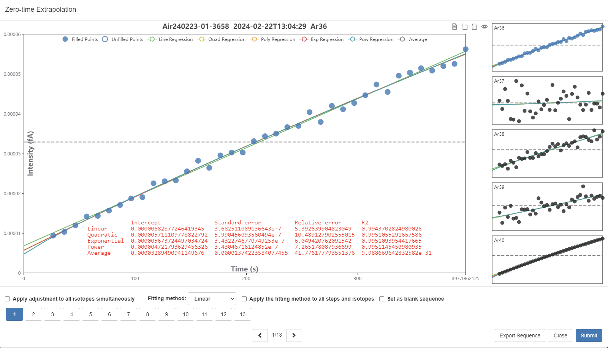

* **指定本底**。

    下图的示例中，1-7-13 三个阶段被指定为本底阶段，可在默认下拉框中选择不同的扣本底策略，也可在各个本底阶段下拉框中灵活选择本底，可在右侧界面对本底进行计算，如 拟合计算插值，详见 [计算本底](#计算本底)。

    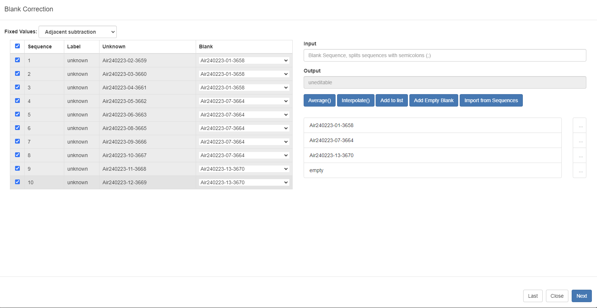

    默认的扣本底策略：
    1. **前置本底**：每个本底被用于矫正在其之后进行的样品阶段，直到下一个本底出现，如果第一个阶段不是本底，则第一个本底也将被用于扣除其之前的几个样品阶段；
    2. **后置本底**：每个本底将用于矫正其之前进行的样品阶段，如果最后一个阶段不是本底，最后一个本底也将被用于扣除最后几个样品阶段；
    3. **邻近本底**：每个本底将被用于矫正距离最近的几个样品阶段。
    4. **本底插值**：以给定的本底信号值和测试时间拟合，每个样品阶段将根据测量时间计算本底值。需要先进性插值计算。

### arr文件

* arr 文件是以二进制保存的JSON序列化之后的Sample对象。


### 创建空白对象

* 创建空白对象需要用户手动粘贴或键入数据。

* 通常当只需要利用 WebArAr 的部分功能时，创建空白对象比较方便。如这些示例：[示例：绘制年龄谱]()，[示例：绘制等时线]()


### 设置原始文件过滤器

1. 从 *Run* 界面编辑 原始文件过滤器。

    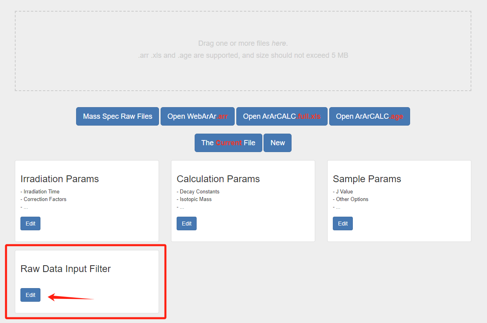

2. 编辑已存在的过滤器（需要验证Pin），或创建一个新的过滤器。

    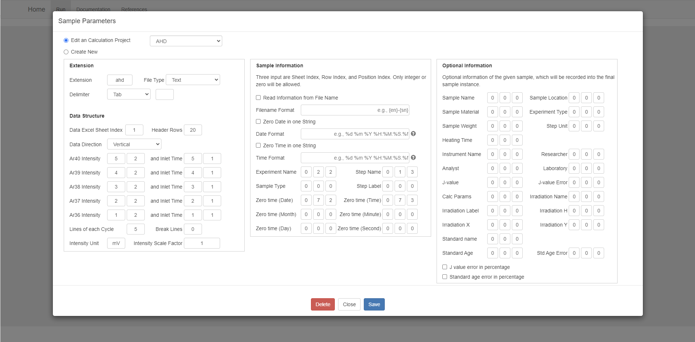

3. 过滤器支持文本格式的文件和Excel多表格文件（xls）。对于 xls 文件，表格序号、行数、列数三位整数用于定位数据；对于文本文件，需要行数和列数两位整数。

4. 示例1：AHD 文件。
    
    文件具有如下结构，TAB制表符分隔。下载该 AHD 文件 [AHD](AHD.ahd) 查看。

    ```
    Sample	sample_name							
    Experiment	experiment_name							
    Project								
    Irradiation								
    Standard								
    Instrument	Argus	1E-13						
    Time Stamp	21/06/2023	0:08:53						
    Analyst								
    Temperature	0	Laser						
    J-Value								
    Fractionation								
    Volume Correction	1							
    Counters	1	15	1	0				
                                    
    Time	Intensity	37	38	39	40		Cycle #	Peakreading #
    96.124784	0.039713085					
    139.839784	0.017819889							
    96.124784	0.095037932							
    96.124784	8.217368387							
    96.124784	52.50271246							
    183.630784	0.039292885							
    227.343784	0.01599587							
    183.630784	0.088180873							
    183.630784	7.980598974							
    183.630784	53.55335785	
    ```
    从文件可以确定各个参数及索引，头部信息 15 行，样品名 (0, 1, 2)，实验名 (0, 2, 2)，零时刻日期 (0, 7, 2)，零时刻时间 (0, 7, 3)，同位素值呈列排列，五个一组，因此36Ar为 (1, 2)，37Ar (2, 2)，38Ar (3, 2)，39Ar (4, 2)，40Ar (5, 2)，对应依次为 (1, 1)，37Ar (2, 1)，38Ar (3, 1)，39Ar (4, 1)，40Ar (5, 1)。注意勾选日期和时间均为单列字符串。

    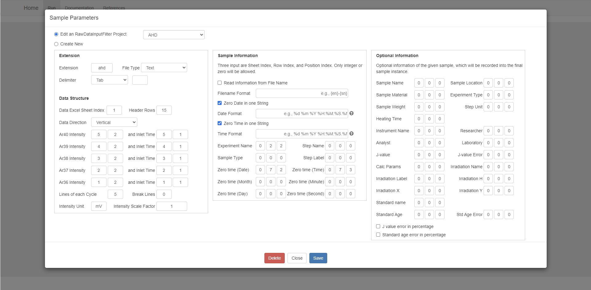

5. 示例2：NGX 导出的 xls 文件。

    文件部分内容如截图所示，详细可下载 [NGX_Exported_XLS](NGX_Exported_XLS.xls) 查看。

    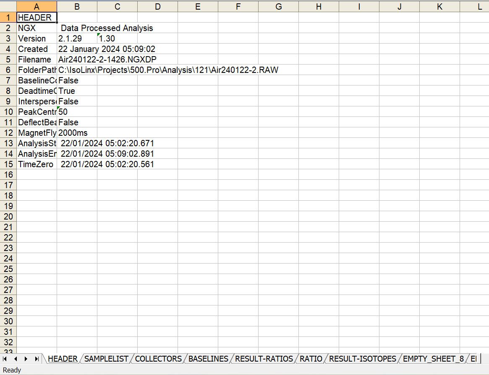

    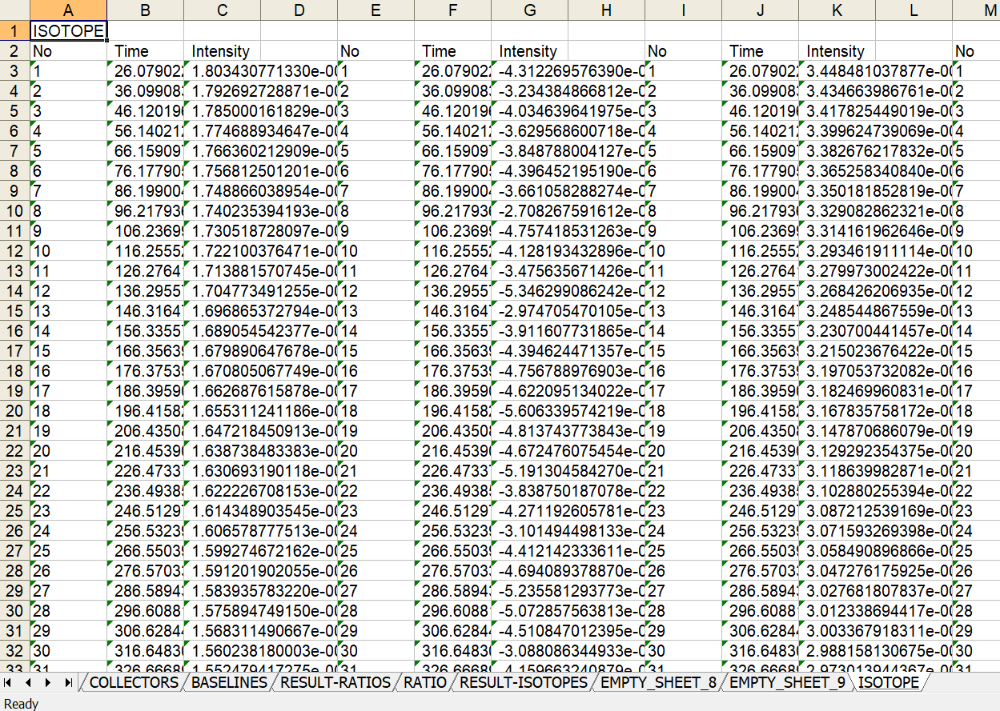

    对于这个文件，过滤器设置如下：

    
	

### 计算本底

1. 单击下方的本底阶段名，将本底名添加到 Input 输入框，再次单击删除该本底。

    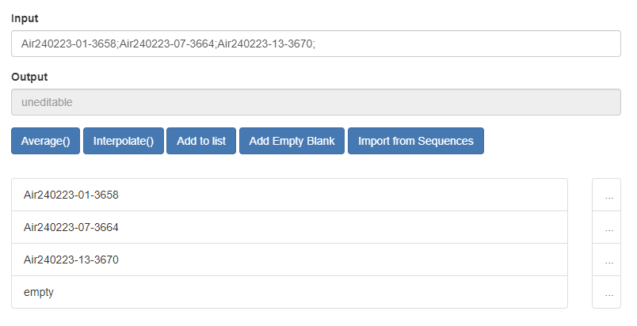

2. 选择求平均 或 拟合插值。

    如下图示例，三个本底阶段拟合约束了中间十个样品阶段的本底值。

    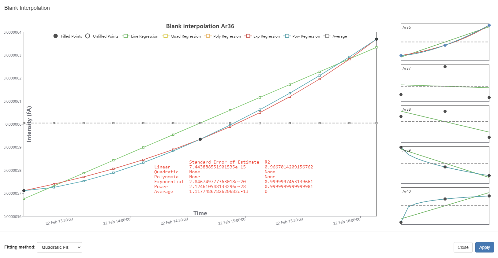

    计算平均值或插值后，新的本底阶段将出现在 Output 文本框中，单击 Add 按钮 将其添加到本底中，之后即可在左侧 本底阶段 下拉框中选择该本底。

    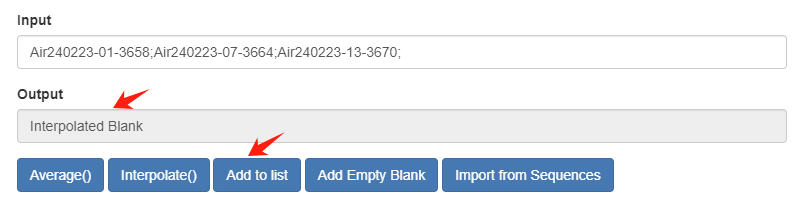


### 图表内容

**表格**

1. Information: 样品信息，如编号、矿物材料、实验室等。
2. Unknown：各样品阶段的同位素值。误差均为一倍 σ 绝对误差。
3. Blank：各样品阶段扣本底所用的同位素值。
4. Corrected：各样品阶段经过必须的校正之后的同位素值，包括本底校正、质量歧视矫正校正和衰变校正。
5. Degas Pattern：各同位素区分来源之后的值。
6. Publish：大多数情况下用于文章中发表Ar-Ar数据，包括阶段名、阶段条件、36Ara、37ArCa、38ArCl、39ArK、40Arr、表观年龄、年龄误差、各阶段内40Arr占比、各阶段39ArK释放占总量的比例、Ca/K值。
7. Age Spectra：40Arr/39ArK 和 表观年龄。
8. Isochrons：等时线数据，包括正反等时线、三个Cl相关图、三位图数据。
9. Total Params：所有参数。

**图件**
1. Age Spectra：年龄谱图。
2. Nor. Isochron：正等时线图。
3. Inv. Isochron：反等时线图。
4. K-Cl-Ar 1：二维Cl相关图 1，三张图的横纵坐标不同。
5. K-Cl-Ar 2：二维Cl相关图 2。
6. K-Cl-Ar 3：二维Cl相关图 3。
7. 3D Correlation：三维校正图。
8. Degas Pattern：显示各个阶段释放的不同同位素比例。
9. Ages Distribution：显示表观年龄的分布，包括柱状图和KDE曲线。

### 参数设置

* 参数设置分了三个类别：辐照参数（Irradiation Params），计算常数（Calculation Params），特征参数（Sample Params）。

* 在 *Run* 界面新增或编辑参数组，之后应用这些参数。

    

* 也可以在 Total Params 表中任意修改参数，这样可以为每个阶段设置不同的参数。

* 辐照参数

    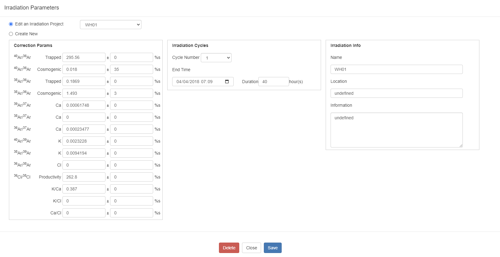

* 计算常数

    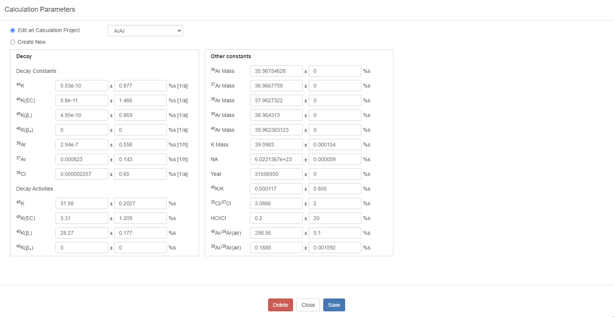

* 特征参数

    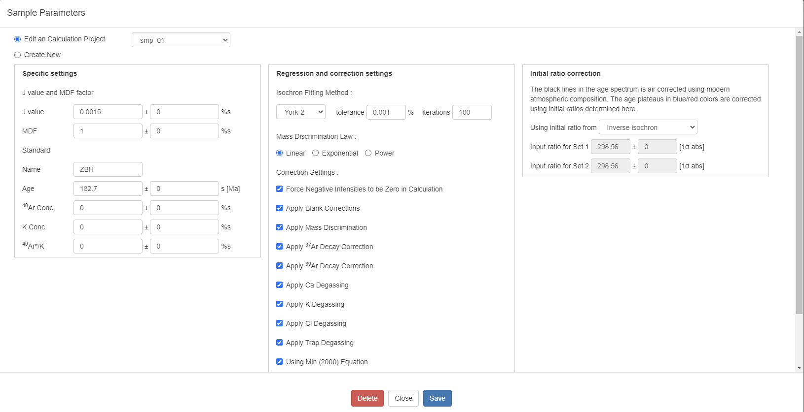

### 重新计算 

* 设置新的参数后并不会自动进行计算。

* 可勾选的选项如图所示：

    - Reset Arr Attributes: 检查Arr结构，可以修正由于程序更新而缺失部分属性的旧文件。
    - Recalculate Correction 和 Degas 用于重新进行校正和Degas，需要勾选特定过程及其之后的计算。例如：修改了本底数据，则需要勾选从本底校正到年龄计算的所有选项，否则新的参数将不会真正作用到最终结果；如果修改了 J 值，则只需要勾选重新计算表观年龄，前面的阶段并不会受 J 值影响，同时还应该重新计算 等时线数据，因此还应该勾选 Reset Plot Data。
    - Reset Plot Style 用于重置图件样式。

    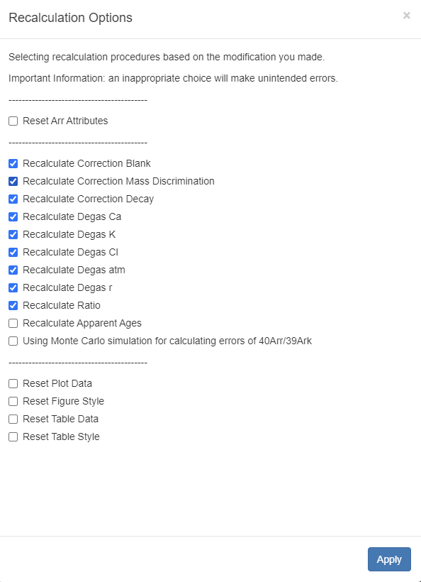

### 等时线选点

* 等时线支持两组选点（Set1 和 Set2），同时将在年龄谱图中绘制相应的年龄坪（年龄坪根据设置用指定的初始值扣除空气氩）。右侧显示两组选点的正反等时线和坪年龄。

    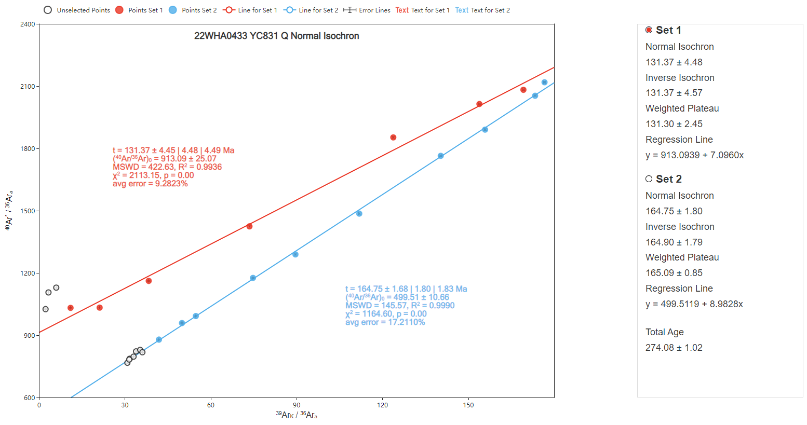

* 单击散点将可以选择或取消选择阶段数据点。每次点击都会自动重新计算回归和年龄，响应速度与网络速度和阶段数有关。

* 为了提高相应速度为了方便操作，可以在按住 Ctrl 键后，连续点击多个数据点，这时不会自动重新计算，之后需要触发重新计算，或松开 Ctrl 的情况下再点击一个散点。

### 修改图件样式

* 点击底部的 Style 按钮，可以设置当前显示的图件的属性信息，如坐标范围、线宽、颜色、字号等。

* 打开 Style 窗体后，点击图件元素，如线、点或文字，可以设置相应元素的属性。
    
    如打开 Style 后点击散点，打开散点属性设置，见下图。

    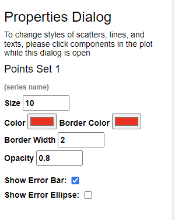

    设置点大小为20：

    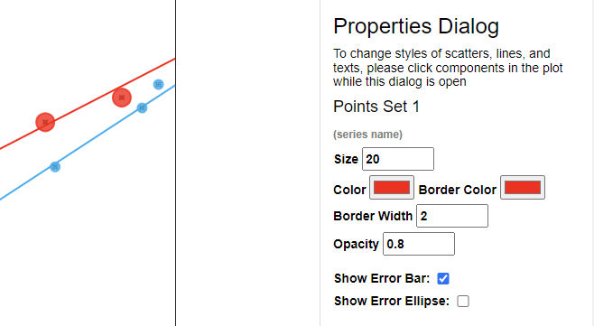

### 用等时线初始值扣空气氩

* 在 特征参数（Sample Parameter）中为 Set1 和 Set2 设置初始值。

* 使用反等时线初始值扣除空气氩：

    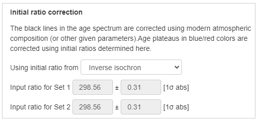

    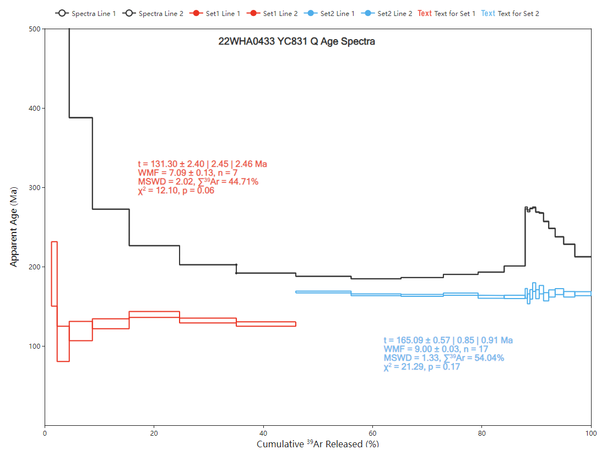

* 使用其他值扣除空气氩，本实例中与黑线参数相同，两者重合：

    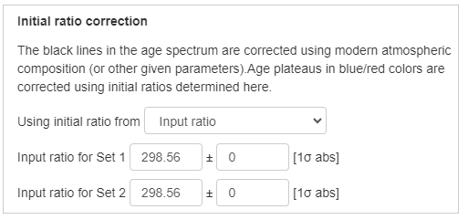
    
    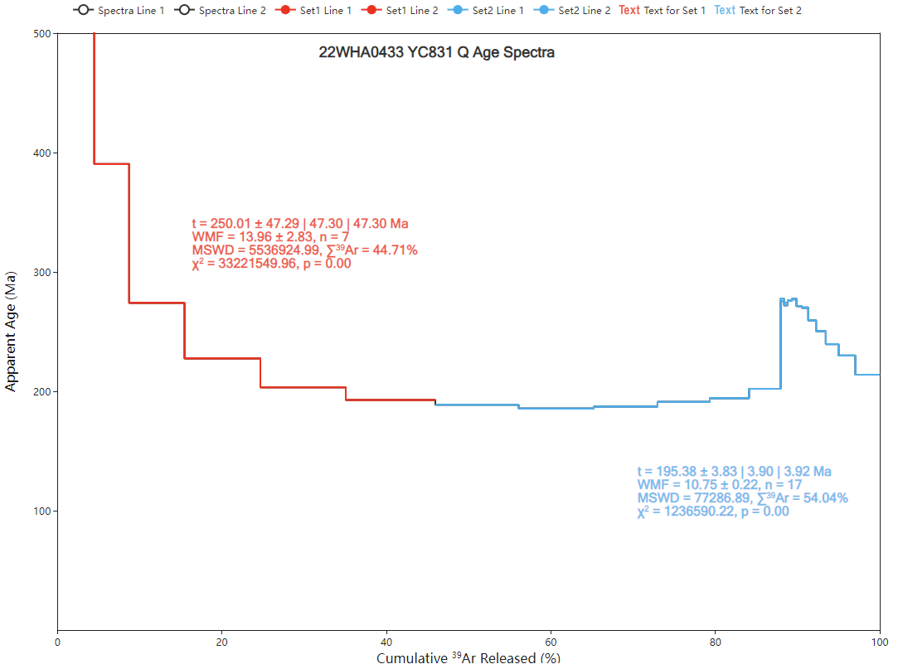

### 年龄分布图

* 年龄分布图常用于单颗粒Ar-Ar年龄分析。数据来自 Age Spectra 表中的表观年龄。包括 KDE 曲线，柱状图，及年龄方块。

    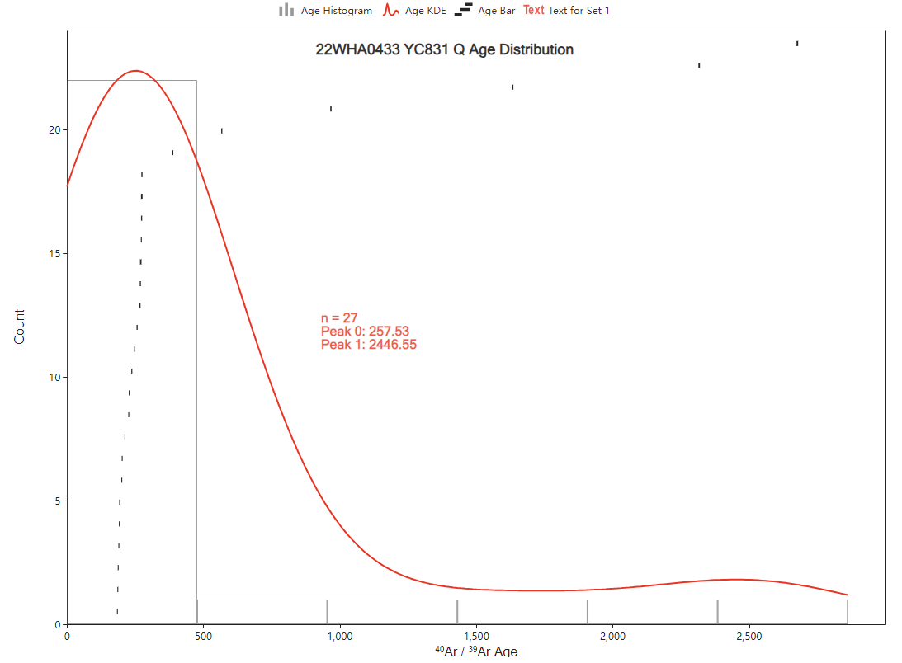

* 打开 Style 后，点击 红色KDE曲线 可以设置属性和KDE参数：
    常用正态概率密度函数，Scott和Sliverman两种自动计算带宽宽度方法，或选择none手动输入宽度。

    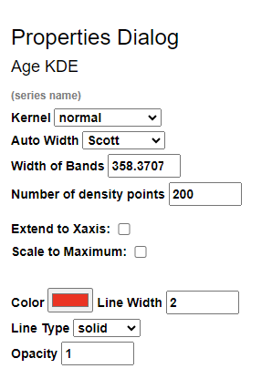

### 保存及导出

* 点击 Export 打开导出对话框。

    

* 下载 arr 文件，单击 sample_name.arr 或右键另存。

* 选择其他格式导出:

    1. Excel：包含所有数据和图表（除三维图）；
    2. PDF：导出二维的图件到PDF，可由Illustrator和CorelDRAW打开编辑。
    3. SVG：导出二维的图件到SVG。

### 示例 1：打开文件

#### 示例 1-1：打开 arr、age、xls 文件

*注意：此处 xls 文件特指 ArArCALC 导出的文件，通常文件名类似 xxxx.full.xls*
下载示例文件：[arr](22WHA0433.arr)、[age](22WHA0433.age)、[full.xls](22WHA0433.full.xls)。

arr 文件

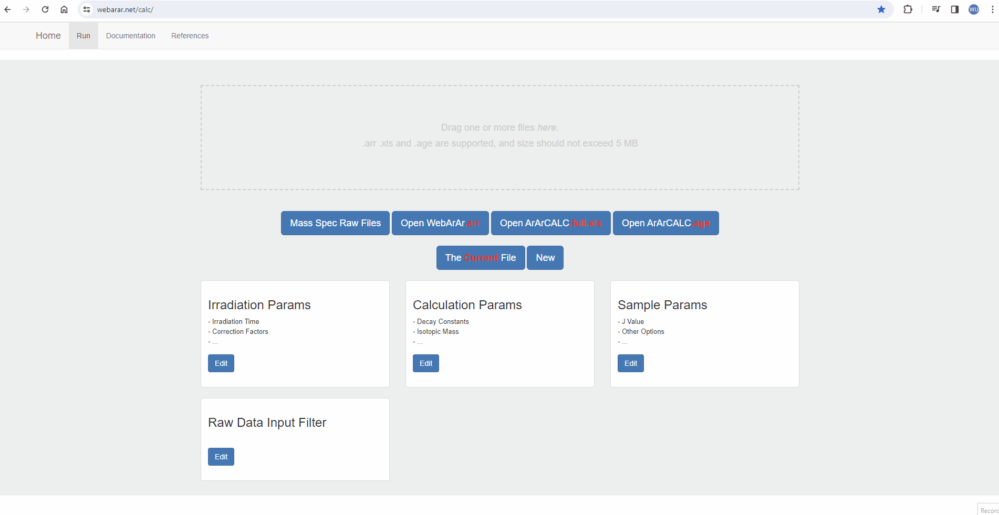

age 文件

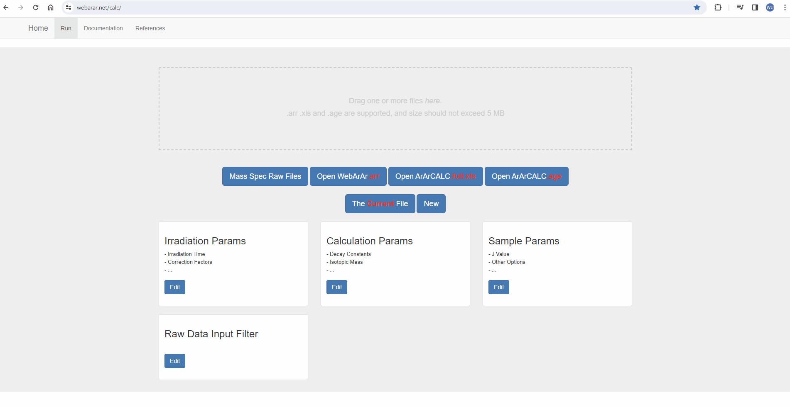

xls 文件


#### 示例 1-2：打开原始文件


### 示例 2：手动输入数据计算或绘图

#### 示例 2-1：绘制年龄谱

如果我们有如下数据，age 列是一系列表观年龄，sage 为对应的误差，39ArK 为每个阶段释放的39ArK占总39ArK的百分数。则可以绘制出年龄谱图。

    ages        sages                   39ArK
    ---------------------------------------------
    310.2176	6.751487				0.609066
    247.3470	5.148231				0.827120
    181.8897	3.651214				1.114444
    78.62951	1.499786				1.164400
    46.35105	0.777316				2.393310
    25.54040	0.332920				4.833698
    17.78667	0.158893				8.091584
    14.99925	0.096756				11.02284
    13.37219	0.062124				12.43698
    12.88552	0.052385				12.25010
    12.82013	0.052100				10.68799
    12.92644	0.057349				8.552752
    13.14080	0.066860				6.502910
    13.50955	0.094057				4.772416
    13.86147	0.108181				3.397764
    14.32179	0.136590				2.627816
    15.01300	0.191949				2.019118
    15.84402	0.240927				1.453867
    15.86743	0.272241				1.095365
    16.73648	0.286714				0.879736
    17.61575	0.396227				0.709635
    17.85348	0.394215				0.579252
    18.15503	0.400108				0.491160
    18.06496	0.418386				0.423491
    17.94611	0.449840				0.397428
    18.49410	0.547799				0.351599
    18.04896	0.498315				0.314126


#### 示例 2-2：绘制等时线

以正等时线为例，对如下数据：

    39ArK/36Ara     s               40Ar*/36Ara     s               r
    ----------------------------------------------------------------------------
    2.2751877337	0.0048052876	1025.80432325	2.0780870475	0.9583594665
    3.2975019175	0.0069230743	1106.38664780	2.2460834483	0.9652901189
    6.0105856008	0.0125928899	1129.37582601	2.2957337825	0.9681744730
    11.011886341	0.0230813208	1031.99720845	2.1002662774	0.9691720209
    21.166235256	0.0445848717	1032.99035293	2.1147591021	0.9694927363
    38.319930905	0.0802844606	1161.70364073	2.3634476617	0.9683575059
    73.534352138	0.1541520678	1424.54372436	2.9001681727	0.9680880478
    123.79413109	0.2600566737	1853.22212767	3.7827521310	0.9679013050
    153.88009163	0.3267535355	2014.19098315	4.1574887414	0.9680163127
    169.26290975	0.3585793106	2082.32698095	4.2899067708	0.9675027883
    176.63909925	0.3841523273	2118.74942736	4.4886093793	0.9702703124
    173.34246119	0.3715170066	2053.75380022	4.2846436868	0.9697460420
    155.86396720	0.3301618618	1890.74520283	3.8947628293	0.9694010629
    140.36930466	0.3062175333	1764.29506449	3.7505862656	0.9717015933
    111.89720737	0.2417092178	1485.86613648	3.1244156563	0.9716471684
    89.596934208	0.1943473730	1289.37540024	2.7214060085	0.9709019830
    74.759825437	0.1629035766	1176.13040758	2.4954842282	0.9700300082
    54.783766008	0.1209899702	992.623614989	2.1345085268	0.9711071450
    49.944918143	0.1124668310	958.882771121	2.1001119929	0.9688506856
    41.885267737	0.0966704784	878.915538075	1.9638220829	0.9645186720
    36.117315422	0.0846212613	817.979157915	1.7920764969	0.9317125525
    35.339155787	0.0910717060	829.231298578	2.1075521253	0.9643027965
    33.032540877	0.0827595535	797.007327462	1.9386916525	0.9667530193
    33.887955355	0.1034956784	822.155008652	2.4563990293	0.9746915090
    31.516055387	0.0875097358	782.986056641	2.1059773490	0.9647646486
    30.867564655	0.1875046762	767.179621092	4.1062809401	0.8801480023
    31.690337436	0.1828130406	786.765990745	4.0486556249	0.8198342732


### 示例 3：等时线选点

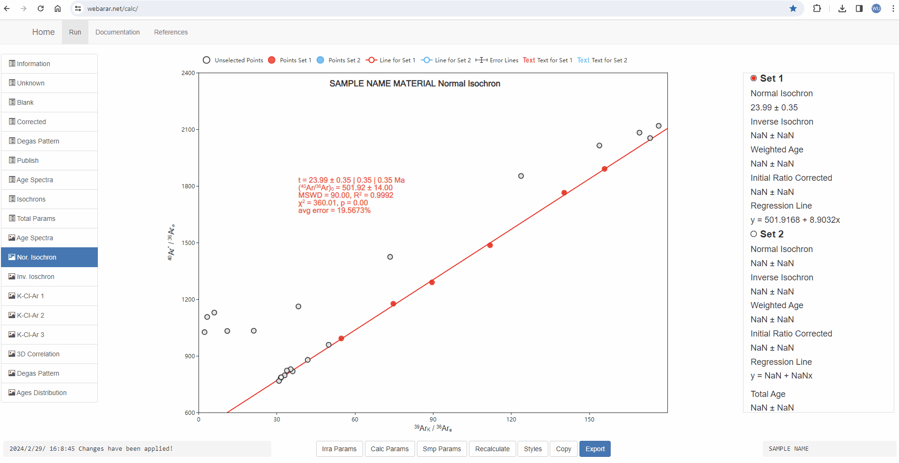

### 示例 4：修改图谱样式

#### 示例 4-1：修改等时线样式

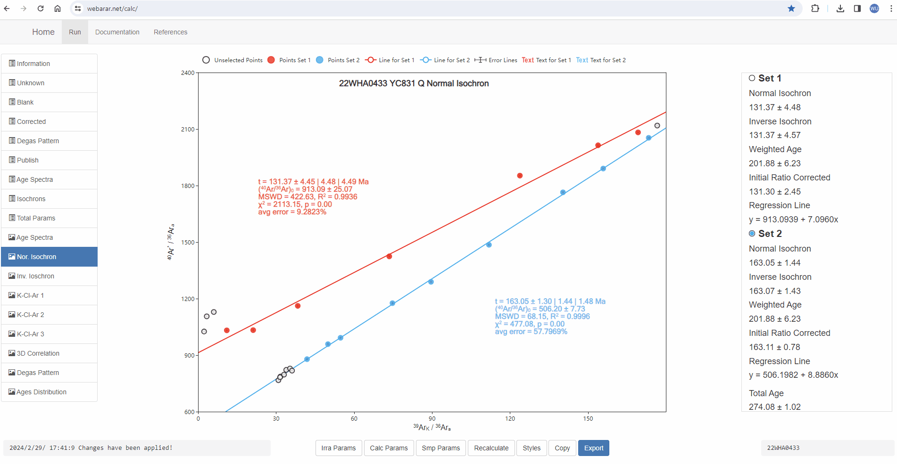

#### 示例 4-2：修改图中文字

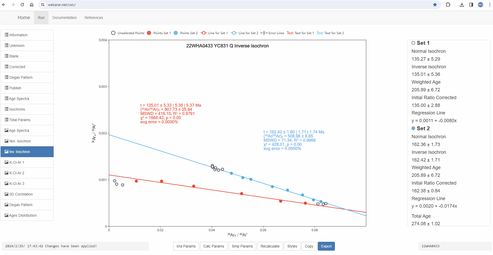

#### 示例 4-3：修改坐标范围

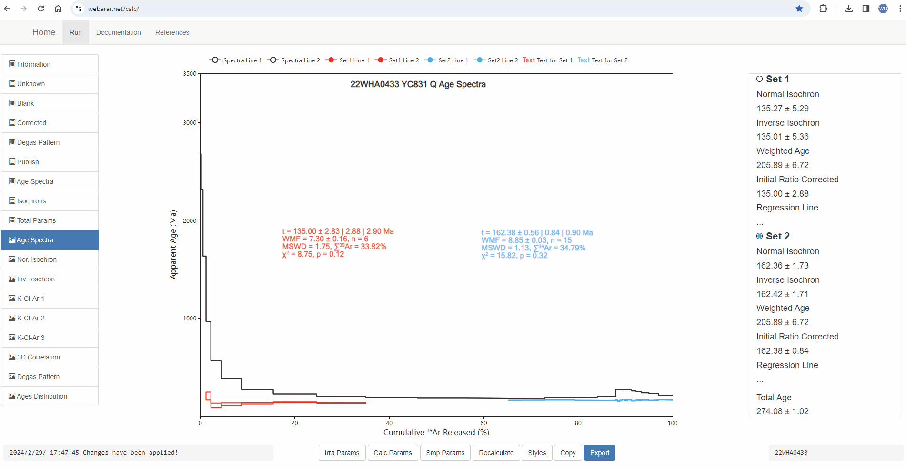

### 示例 5：导出和保存

#### 示例 5-1：保存 arr

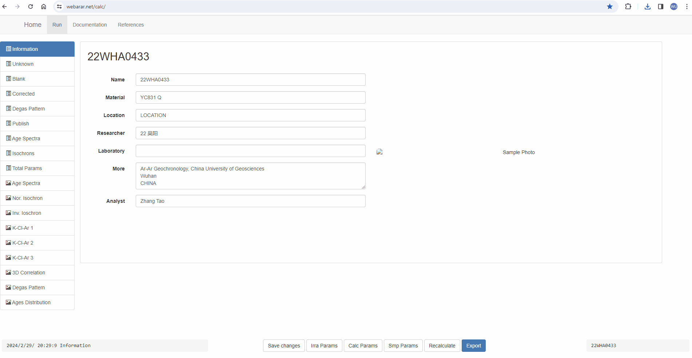

#### 示例 5-2：导出到DPF

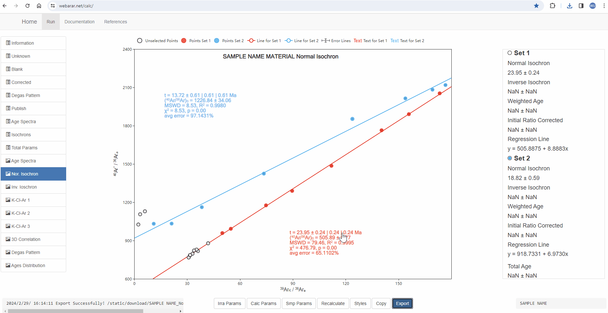

#### 示例 5-3：导出到EXCEL

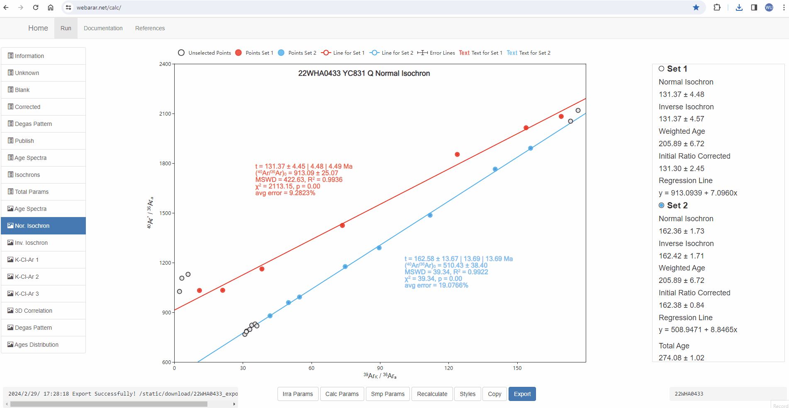

### 示例 6：修改参数集

#### 示例 6-1：创建新的参数集

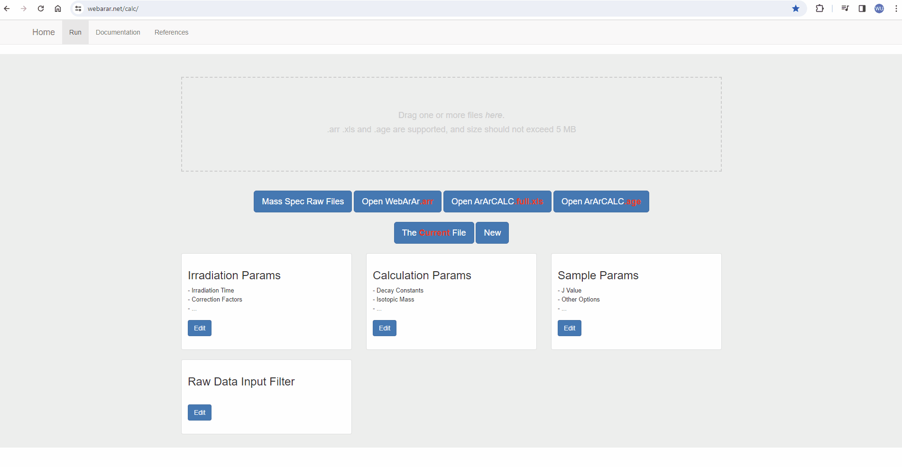

#### 示例 6-2：修改参数集

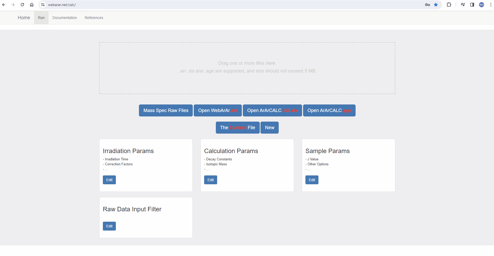

#### 示例 6-3：删除参数集

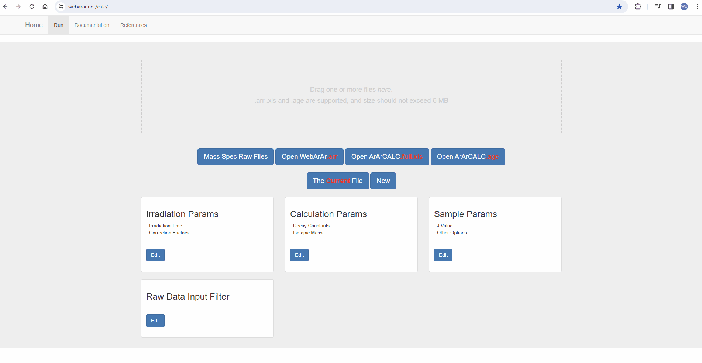

